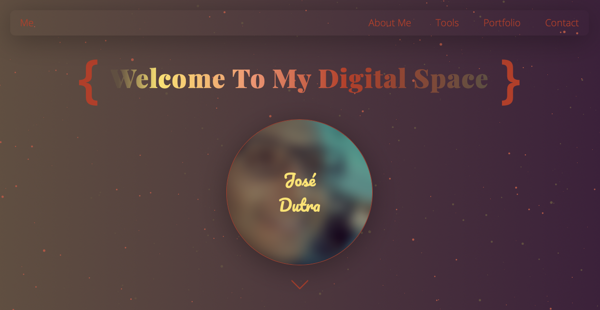
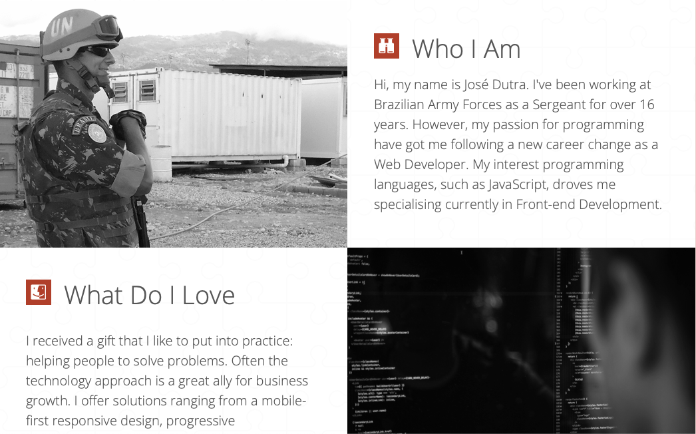
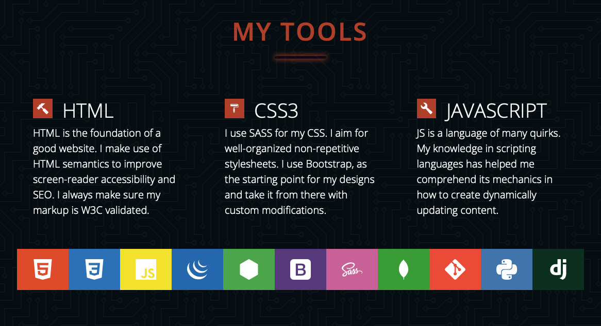
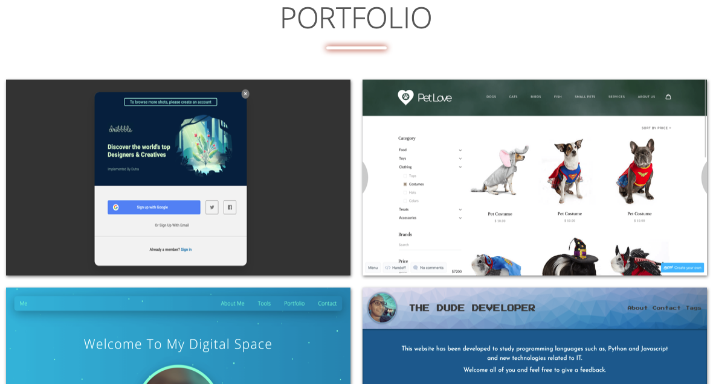
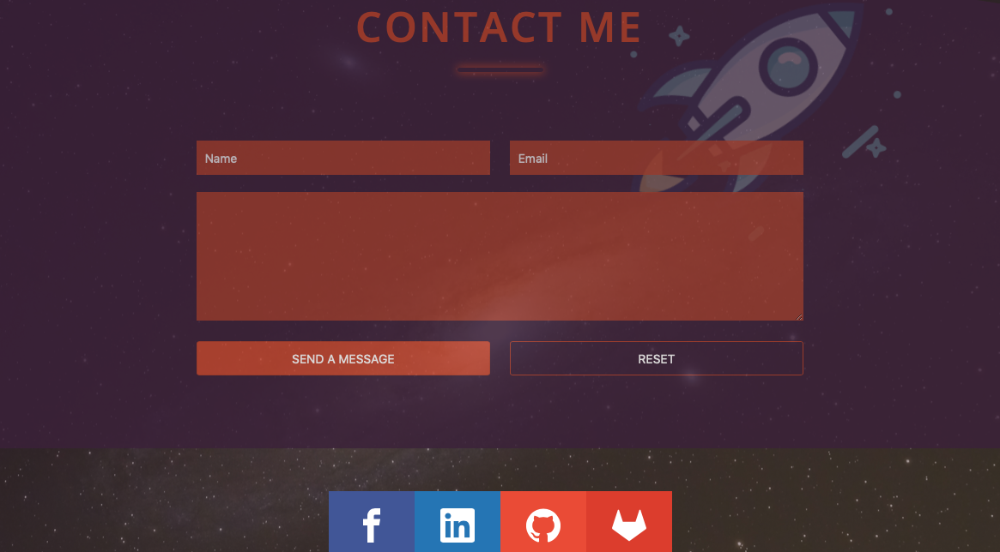

# Personal Portfolio

## My personal Portfolio and my current projects

### Front-end

- HTML
- JavaScript & jQuery
- CSS & SASS
- Bootstrap 4 (grid systems)
- Responsive Design

---

### npm dependencies

- node-minify/cli
- live-server

---

### npm dev-dependencies

- @node-minify/uglify-js
- autoprefixer
- concat
- node-minify
- node-sass
- npm-run-all
- postcss-cli
- uglify-js

---

### Installing

```
npm install
```

---

## Live Demo

### https://dutraneto.com/portfolio

---

### Screenshots







### TODO

- Finish Responsive Design for sections
- Add sandwich menu for mobile designs
- Add support for IE browser
